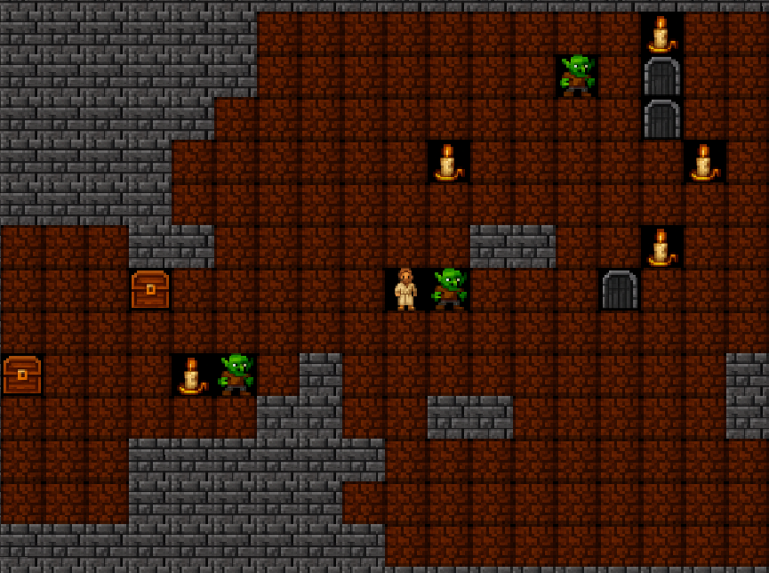

# Narrow Gate MMO

Step into a living maze where faith is your fuel, Temptations lurk in every corridor,
and every doorway leads higher into the unknown. Narrow Gate MMO is a Christian-
themed rogue-like adventure you can play instantly in your browser.

Live demo: http://MinistriesForChrist.net:26472/

Contact: David Slimp (rock808@David-Slimp.com)

---

## What It Is
- A real-time, multiplayer, grid-based maze crawler
- Built for quick play sessions with surprising depth
- Faith-themed challenges, verses, and progression
- No download required for the web client

---

## Quick Start (Players)
1. Open the live demo URL in your browser.
2. Move around, explore, and collect powerups.
3. Drop walls to shape the maze and block Temptations and survive.

---

## Controls
- Arrow Keys: Move
- Space: Drop a wall (uses your wall inventory)
- Tab: Focus chat
- Enter: Send chat
- Esc: Cancel chat
- C: Change character sprite
- H: Toggle help overlay
- M: Toggle mute
- Q: Quit and save

---

## Items and Hazards
- Faith ($): Increases your faith
- Health (H): Restores health
- Buster (B): Breaks walls (*)
- Wall (W): Lets you drop walls
- Filler (F): Negates lava damage
- Lava (~): Hurts health and faith

---

## Tips and Tricks
- Walls can block monsters and other players. Use them wisely.
- Keep an eye on faith and health. Both matter.
- Doors (Up and Down) lead between areas (try to go "Up" more often). Explore carefully.
- Chat can change your name with: `name: YourName`

---

## What Makes It Different
- Christian-themed atmosphere and verse broadcasts
- Persistent character saves
- A growing world of connected areas
- Simple controls with tactical depth

---

## Coming Soon (Planned)
- More monster types and behaviors
- Expanding areas and map variety
- Deeper progression and inventory systems
- Improved UI polish and accessibility
- Community-driven custom clients

---

## Have Fun
If you enjoy old-school roguelikes, multiplayer chaos, or Christian-themed games,
this is your new playground. Jump in and explore.
